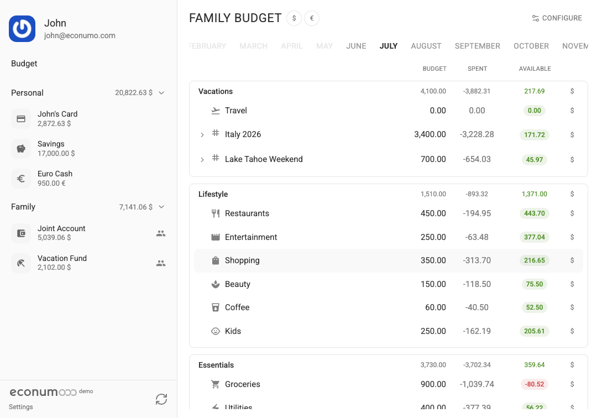
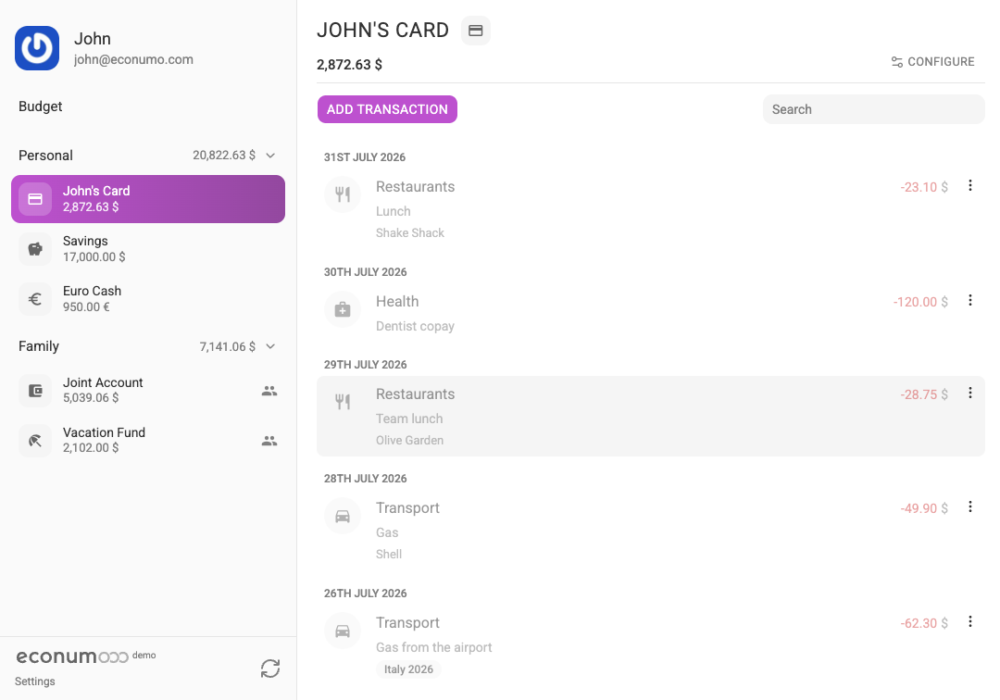
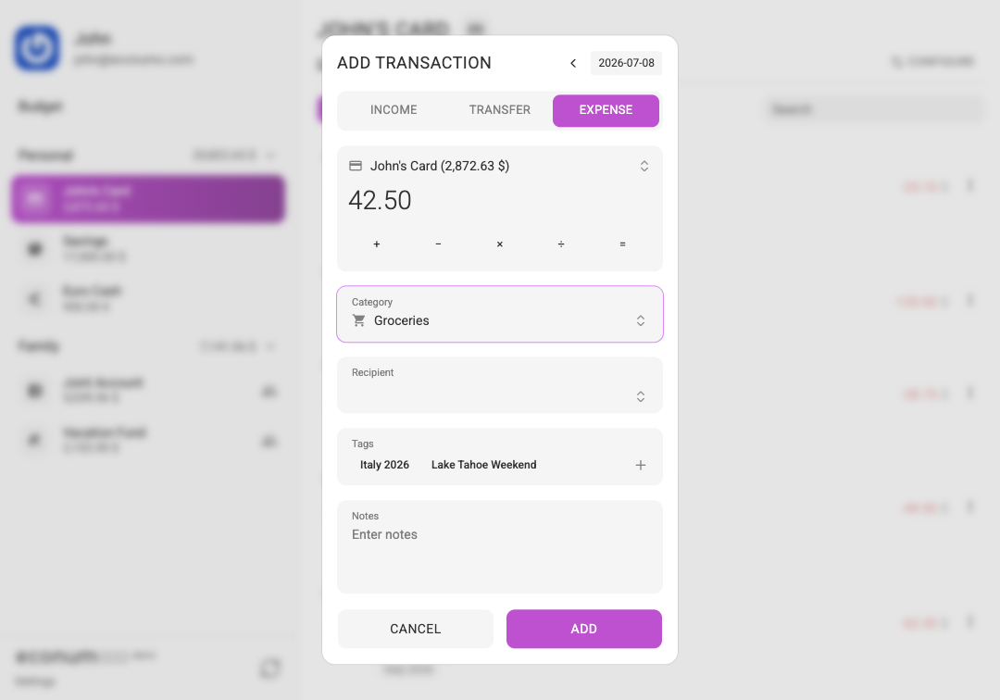
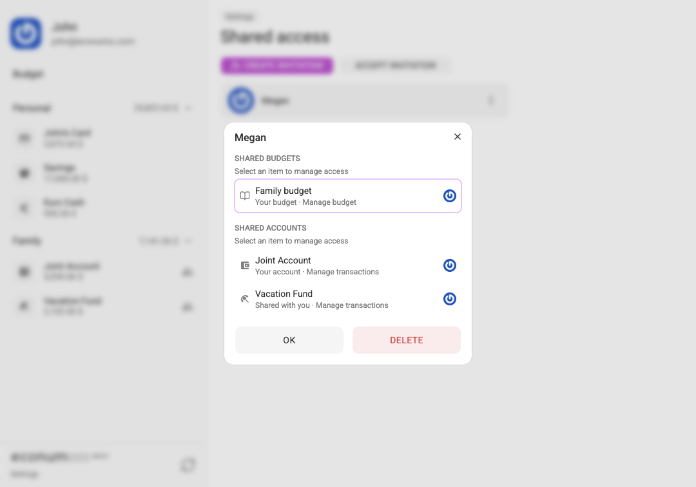
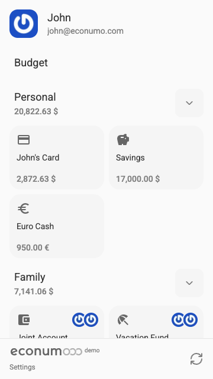

<p align="center">
    <picture>
        
    </picture>
</p>

<p align="center">
    A getting started guide to self-hosting <a href="https://econumo.com/docs/edition" target="_blank">Econumo</a> — a personal finance & budgeting app
</p>

---

Econumo ships as a single, self-contained Go binary in a distroless Docker image.
It serves both the API and the web app, runs database migrations automatically on
boot, and works with SQLite (default) or PostgreSQL.

<p align="center">
    
</p>

<details>
<summary><b>More screenshots</b> — transactions, adding a transaction, sharing with family</summary>
<br>
<table>
  <tr>
    <td align="center"><br><sub>Transactions</sub></td>
    <td align="center"><br><sub>Adding a transaction</sub></td>
  </tr>
  <tr>
    <td align="center"><br><sub>Manage money together</sub></td>
    <td align="center"><br><sub>Works great on mobile</sub></td>
  </tr>
</table>
</details>

> [!IMPORTANT]
> The Docker image is now published to the **GitHub Container Registry**:
> `ghcr.io/econumo/econumo`. The old Docker Hub image (`econumo/econumo-ce`)
> belongs to v0.x and is no longer updated — update your `docker-compose.yml`
> or pull references accordingly.

### Quick start

You'll need [Docker](https://docs.docker.com/engine/install/) with
[Compose](https://docs.docker.com/compose/install/). The app itself is
lightweight — it consumes up to 10 MB of RAM.

```console
$ git clone --single-branch https://github.com/econumo/econumo
$ cd econumo
$ cp .env.example .env
$ docker compose pull && docker compose up -d
```

Then visit `http://localhost:8181` and create the first user.

> [!NOTE]
> To build the image from source instead of pulling, run
> `docker compose up -d --build` (the `Dockerfile` is in
> [`deployment/docker/`](deployment/docker/Dockerfile)). Health is reported
> at `/health`.

### Configuration

Everything is configured through environment variables in `.env` —
[`.env.example`](.env.example) is the full, commented reference for every
setting (database, mail, currencies, CORS, logging). The defaults
work out of the box: SQLite storage and registration enabled; the only
variables most setups ever touch are `DATABASE_URL` (to switch to PostgreSQL)
and `MAILER_DSN` (to send password-recovery email).

CLI commands (create users, update currency rates, …) run through the binary
inside the container, e.g.:

```console
$ docker compose exec econumo /app/econumo user:create "Name" user@example.com password
```

### Localization

All translations live in [`locales/`](locales/) — one JSON catalogue per
language, shared by the backend and the web app and managed right in the
repository (no external translation platform). To contribute a language, copy
[`locales/en.json`](locales/en.json), translate the values, and open a pull
request — the test suite verifies key and placeholder parity between
catalogues automatically.

### MCP

Econumo speaks [MCP](https://modelcontextprotocol.io/) natively — the binary
exposes a Streamable HTTP endpoint at `/mcp` (stateless, JSON responses) so
Claude Code, Claude Desktop, Cursor, and any other MCP client can read your
accounts/budgets/transactions and log expenses over the network, no extra
process required.

Auth reuses the existing bearer tokens: any access token works, but a
personal access token
(`Settings → Personal access tokens` in the app) is the intended credential —
it doesn't expire on inactivity like a session does. Point your client at
`https://your-econumo.example.com/mcp` with a static `Authorization` header:

```jsonc
// Claude Code (.mcp.json) / Claude Desktop / Cursor — remote server with a static header:
{
  "mcpServers": {
    "econumo": {
      "type": "http",
      "url": "https://your-econumo.example.com/mcp",
      "headers": { "Authorization": "Bearer eco_pat_..." }
    }
  }
}
```

> [!NOTE]
> claude.ai web **custom connectors** require OAuth and aren't supported yet
> — use Claude Code, Claude Desktop, or another client that accepts a static
> bearer header.

**Resources** (read-only, scoped to the authenticated user):

| URI | Content |
|---|---|
| `econumo://accounts` | accounts with type, currency, archived flag, and current balance |
| `econumo://categories` | expense/income categories |
| `econumo://tags` | tags |
| `econumo://payees` | payees |
| `econumo://currencies` | currency codes + rates vs. the instance base currency |
| `econumo://budgets` | the user's budgets (id, name, currency) |
| `econumo://user` | the current user's profile + connected (shared-access) users |

**Tools:**

| Tool | Purpose |
|---|---|
| `get_budget` | full monthly budget state (folders/envelopes/categories/tags, limits, spent, available) |
| `list_transactions` | list transactions, optionally filtered by account and period |
| `create_transaction` | record an expense, income, or transfer |
| `update_transaction` | edit an existing transaction |
| `delete_transaction` | delete a transaction |
| `list_accounts` | same data as `econumo://accounts` |
| `list_categories` | same data as `econumo://categories` |
| `list_tags` | same data as `econumo://tags` |
| `list_payees` | same data as `econumo://payees` |
| `list_currencies` | same data as `econumo://currencies` |
| `list_budgets` | same data as `econumo://budgets` |
| `get_user` | same data as `econumo://user` |

The `list_*`/`get_user` tools exist because resources are
application-controlled — some clients (e.g. Claude Desktop) can't read them
without the user manually attaching them — so these give any client a
model-driven way to look up ids.

**Prompts:** `log-expense` (turn a free-text description like "27.50
groceries at Lidl yesterday, card" into a recorded transaction) and
`budget-review` (summarize a month's budget, flagging overspent envelopes).

### Upgrading from v0.x (PHP)

v1.x is a full rewrite — the PHP backend became the Go binary and the Vue.js
frontend became a React app. The result: memory consumption dropped from
~200 MB to ~10 MB, the app is much faster, and the new UI is a big step up.
Your database is reused in place — accounts, passwords, and data keep
working. See the
**[migration guide](docs/migration-v0-to-v1.md)** for the step-by-step
walkthrough (backup, new image, `.env` mapping, and the gotchas).

### Next steps

- [How to configure multi-currency support](https://econumo.com/docs/self-hosting/multi-currency/) (Econumo comes preloaded with **USD** only).
- [How to configure backups](https://econumo.com/docs/self-hosting/backups/).
- [Useful CLI commands](https://econumo.com/docs/self-hosting/cli-commands/).
- [How to debug Econumo](https://econumo.com/docs/self-hosting/debug/).
- [Econumo API](https://econumo.com/docs/api/).
- [User Guide](https://econumo.com/docs/user-guide/).

For more information please see our [documentation](https://econumo.com/docs/).

### Contact

- For release announcements, please check [GitHub Releases](https://github.com/econumo/econumo/releases) or [Econumo Website](https://econumo.com/tags/release/).
- For questions, issue reporting, or advice, please use [GitHub Issues](https://github.com/econumo/econumo/issues).

---
> [!NOTE]
> Econumo is funded by our `GitHub Sponsors` and `Econumo` (cloud) subscribers.
>
> If you know someone who might [find Econumo useful](https://econumo.com/), we'd appreciate if you'd let them know.
